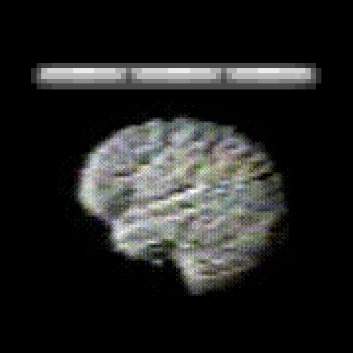

# DestructionBar

Плагин, который добавляет боссбар (с возможностью сделать туман) и точки,
которые могут влиять на боссбар в указанном радиусе.

- Полная кастомизация боссбаров
- Всё выполняется асинхронно
- Возможность перезагрузить конфиг (`/destructionbar reload`)
- Без лишних зависимостей
- Для Paper 1.21.1+
- Переделка легендарного `CorpseBar.sk`

## Конфиг

```yaml

# Можно убрать всю секцию default, тогда стандартного бара не будет
default:

  # https://docs.papermc.io/adventure/minimessage/format/
  title: '<rainbow>Поддерживает MiniMessage!'

  # https://jd.advntr.dev/api/4.26.1/net/kyori/adventure/bossbar/BossBar.Color.html
  # Доступные цвета: BLUE, GREEN, PINK, PURPLE, RED, WHITE, YELLOW
  color: WHITE

  # https://jd.advntr.dev/api/4.26.1/net/kyori/adventure/bossbar/BossBar.Overlay.html
  # Доступные стили: PROGRESS, NOTCHED_6, NOTCHED_10, NOTCHED_12, NOTCHED_20
  style: NOTCHED_12

  # https://jd.advntr.dev/api/4.26.1/net/kyori/adventure/bossbar/BossBar.Flag.html
  # Доступные флаги: CREATE_WORLD_FOG, DARKEN_SCREEN, PLAY_BOSS_MUSIC
  flags:
    - CREATE_WORLD_FOG
    - DARKEN_SCREEN

test-point:

  # Расположение точки
  location:
    ==: org.bukkit.Location
    world: world
    x: 0.0
    y: 100.0
    z: 0.0

  # Радиус в блоках, на котором действует точка
  radius: 100

  # Изменять ли прогресс боссбара в зависимости от расстояния до точки
  show-progress: true

  # Перезапись default параметров
  title: '<yellow>Нулевые координаты'
  color: YELLOW
  style: PROGRESS
  flags: []
```